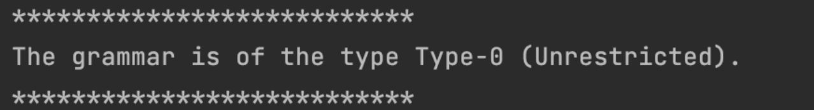
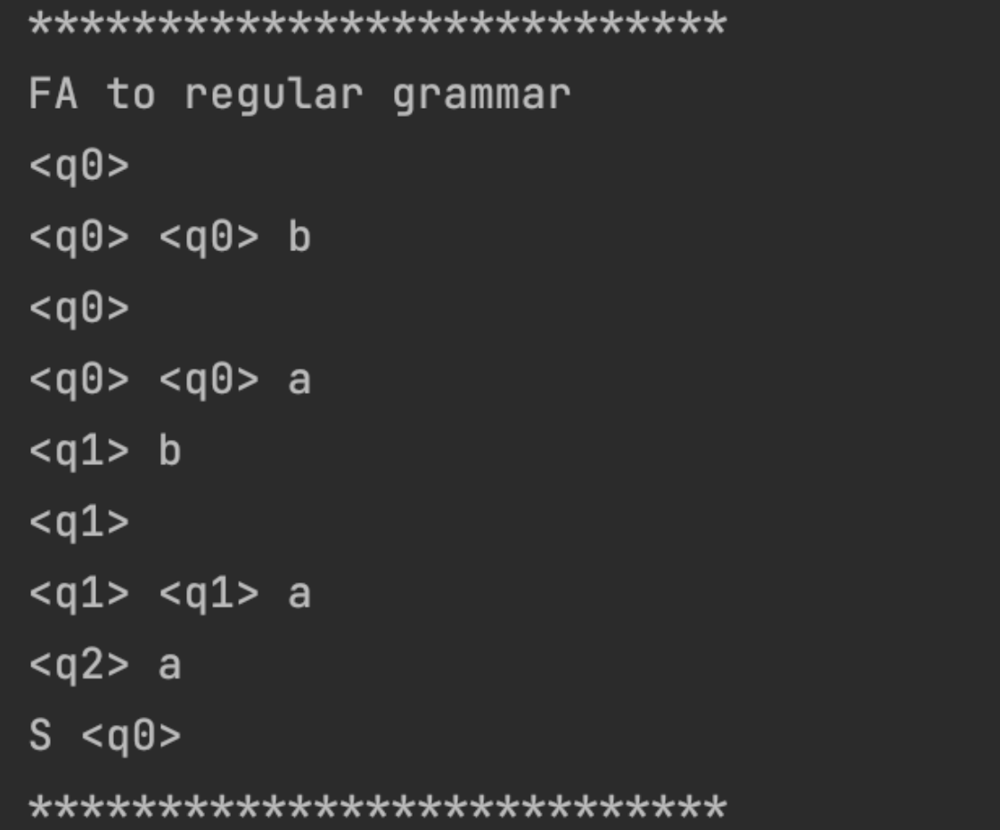
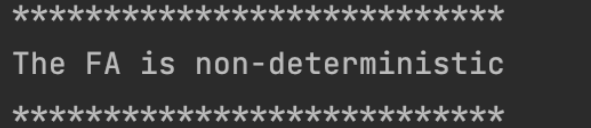
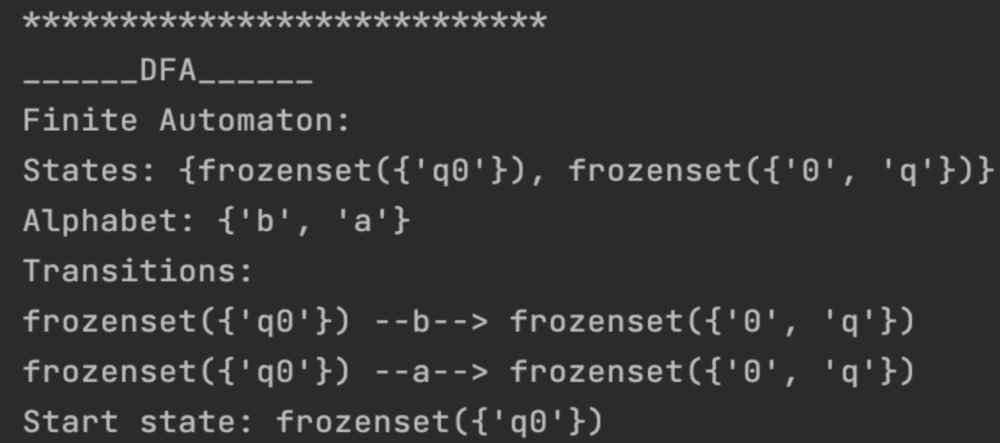
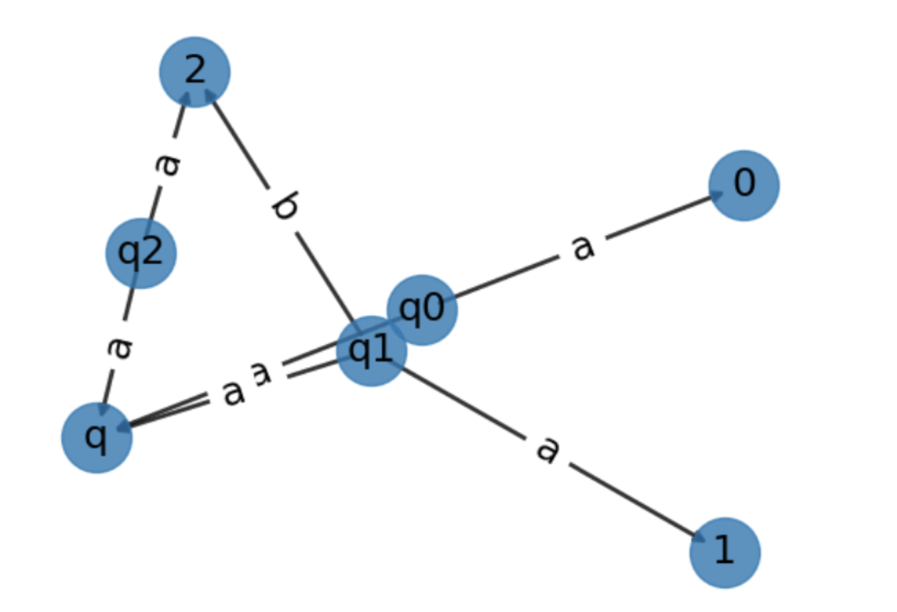

# Determinism in Finite Automata. Conversion from NFA to DFA. Chomsky Hierarchy.
## Course: Formal Languages & Finite Automata
## Author: Dionisie Spataru FAF-211

Variant 24

Q = {q0,q1,q2},

∑ = {a,b},

F = {q2},

δ(q0,b) = q0,

δ(q0,b) = q1,

δ(q1,b) = q2,

δ(q0,a) = q0,

δ(q2,a) = q2,

δ(q1,a) = q1.


## Theory
Finite Automata: A finite automaton (FA) is a mathematical model of a computing machine that recognizes a regular language. It consists of a set of states, a set of input symbols, a transition function, a start state, and a set of final states. There are two types of finite automata: deterministic finite automata (DFA) and non-deterministic finite automata (NFA).
Grammar Types: Grammars are formal rules that define the structure of a language. There are four types of grammars: type 0 (unrestricted), type 1 (context-sensitive), type 2 (context-free), and type 3 (regular). These types are arranged in the Chomsky hierarchy, with type 0 being the most powerful and type 3 being the least powerful.
Chomsky Hierarchy: The Chomsky hierarchy is a classification of formal grammars based on their generative power. It was proposed by linguist Noam Chomsky in the 1950s. The four types of grammars in the Chomsky hierarchy are as follows:
● Type 0: Unrestricted grammars. They can generate any language that can be recognized by a Turing machine.
● Type 1: Context-sensitive grammars. They can generate languages that can be recognized by a linear-bounded automaton.
● Type 2: Context-free grammars. They can generate languages that can be recognized by a non-deterministic pushdown automaton.
● Type 3: Regular grammars. They can generate languages that can be recognized by a finite automaton. Deterministic Finite Automata (DFA): A DFA is a finite automaton that recognizes a regular language. It has the
following properties:
● It has a finite set of states.
● It has a finite set of input symbols.
● It has a transition function that maps each state and input symbol to a new state.
● It has a designated start state.
● It has a set of final states.
A DFA can be used to recognize strings that belong to a regular language. However, it cannot recognize all languages, as it is less powerful than other types of automata such as non-deterministic finite automata.

## Objectives:
- Understand what an automaton is and what it can be used for.

- Continuing the work in the same repository and the same project, the following need to be added:

  a. Provide a function in your grammar type/class that could classify the grammar based on Chomsky hierarchy.

  b. For this you can use the variant from the previous lab.

- According to your variant number (by universal convention it is register ID), get the finite automaton definition and do the following tasks:

  a. Implement conversion of a finite automaton to a regular grammar.

  b. Determine whether your FA is deterministic or non-deterministic.

  c. Implement some functionality that would convert an NDFA to a DFA.

  d. Represent the finite automaton graphically:
    - You can use external libraries, tools or APIs to generate the figures/diagrams.
    - Your program needs to gather and send the data about the automaton and the lib/tool/API return the visual representation.

## Implementation description
### Chomsky hierarchy

```python
 def classify(self):
# Check if the grammar is type-0
if not all(len(production) <= len(symbol_string) for symbol_string in
self.P.values() for production in symbol_string):
return "Type-0 (Unrestricted)"
# Check if the grammar is type-1
if not all(len(production) < len(symbol_string) for symbol_string in self.P.values() for production in
symbol_string if len(production) > 0): return "Type-1 (Context-Sensitive)"
# Check if the grammar is type-2
if all(len(production) == 1 and production.isupper() for symbol_string in self.P.values() for production in
symbol_string):
return "Type-2 (Context-Free)"
# Check if the grammar is type-3
if all((len(production) == 2 and production[0] in self.VN and production[1] in self.VT) or production == 'e' for
symbol_string in self.P.values() for production in symbol_string): return "Type-3 (Regular)"
# If none of the above conditions hold, then the grammar is not a valid Chomsky type
return "Not a valid Chomsky type"
```
Grammar object has methods to check if it belongs to each Chomsky type. The function checks each type in turn, starting from the most powerful type (Type 0) and ending with the least powerful type (Type 3). If the grammar doesn't belong to any of the four types, it returns "Unknown".



### Fa to regular grammar

```python
    def to_regular_grammar(self):
        rules = []
        # Create a rule for each transition
        for (state, symbol), next_state in self.transitions.items():
            # If the transition goes to an accept state, add it to the RHS of the rule
            if next_state in self.accept_states:
                rhs = symbol
            # Otherwise, add a new nonterminal symbol and create a rule to that symbol and the symbol on the RHS
            else:
                rhs = f"<{next_state}> {symbol}"
                rules.append(f"<{next_state}> {'|'.join([symbol + f'<{s}>' for s in self.states if (next_state, s) in self.transitions.keys()])}")
            # Add the new rule to the list of rules
            rules.append(f"<{state}> {rhs}")
        # Create the start symbol and add it to the rules
        rules.append(f"S <{self.start_state}>")
        # Join the list of rules and return them as a string
        return "\n".join(rules)
```
Initialize an empty list called rules to store the grammar rules.
Iterate over each transition in the automaton, represented by (state, symbol), next_state pairs.
Check if the next_state is an accept state. If it is, create a rule where the RHS (right-hand side) is simply the symbol.
If the next_state is not an accept state, create a new nonterminal symbol represented by <next_state>. The RHS of the rule will include the symbol and additional nonterminal symbols for each possible transition from next_state to another state. These nonterminal symbols are generated using a list comprehension and are of the form symbol<state>.
Append the newly created rule to the rules list.
After iterating over all transitions, create a start symbol rule by appending S <start_state> to the rules list.
Join all the rules in the rules list with newline characters (\n) to form a string representing the regular grammar.
Return the resulting regular grammar as a string.

In summary, the code constructs a regular grammar by analyzing the transitions in the finite automaton. Each transition is converted into a grammar rule, with additional nonterminal symbols introduced to represent transitions to other states. The resulting regular grammar represents the behavior of the original finite automaton in terms of string generation.




### FA-deterministic or no-deterministic

```python
    def is_deterministic(self):
        # implementation of is_deterministic method
        visited_states = set()
        queue = [self.start_state]
        while queue:
            curr_state = queue.pop(0)
            if curr_state in visited_states:
                return False
            visited_states.add(curr_state)
            for symbol in self.alphabet:
                next_states = set()
                for state, trans_symbol in self.transitions.keys():
                    if state == curr_state and trans_symbol == symbol:
                        next_states.add(self.transitions[(state, trans_symbol)])
                if len(next_states) != 1:
                    return False
                queue.extend(next_states)
        return True
```
To determine the determinism of an FA, we need to check whether the FA has the ability to "guess" or "choose" which state to transition to based on the input, or whether the transition is uniquely determined by the input symbol and the current state.



### NDFA to DFA

```python
    def convert_to_dfa(self):
        """
        Converts an NDFA to a DFA
        """
        # Set of states in the DFA
        dfa_states = set()
        # Dictionary representing the transition function of the DFA
        dfa_transitions = {}
        # Start state of the DFA
        dfa_start_state = frozenset([self.start_state])
        # Set of accept states in the DFA
        dfa_accept_states = set()
        # Queue for storing states to be processed
        queue = [dfa_start_state]

        # Loop through states in the queue
        while queue:
            # Get the next state from the queue
            state = queue.pop(0)
            # Add the state to the set of DFA states
            dfa_states.add(state)
            # Check if the state contains an accept state from the NDFA
            if any(s in self.accept_states for s in state):
                dfa_accept_states.add(state)
            # Loop through each symbol in the alphabet
            for symbol in self.alphabet:
                # Get the set of states reachable from the current state with the current symbol
                next_state = set()
                for s in state:
                    if (s, symbol) in self.transitions:
                        next_state.update(self.transitions[(s, symbol)])
                # If the set of states is not empty
                if next_state:
                    # Convert the set of states to a single state name
                    next_state_name = frozenset(next_state)
                    # Add the transition to the DFA transition function
                    dfa_transitions[(state, symbol)] = next_state_name
                    # If the next state has not been processed, add it to the queue
                    if next_state_name not in dfa_states:
                        queue.append(next_state_name)

        # Create a new DFA object with the computed properties
        dfa = FiniteAutomaton(states=dfa_states, alphabet=self.alphabet,
                              transitions=dfa_transitions, start_state=dfa_start_state,
                              accept_states=dfa_accept_states)
        return dfa
```
Converting a non-deterministic finite automaton (NDFA) to a deterministic finite automaton (DFA) involves constructing a new DFA that recognizes the same language as the original NDFA. The basic idea is to create a DFA that simulates the behavior of the NDFA, where each state in the DFA corresponds to a set of states in the NDFA.



### FA graphic representation
```python
    def render(self):
        # Create a directed graph using networkx
        G = nx.DiGraph()

        # Add nodes to the graph
        for state in self.states:
            G.add_node(state, shape='circle')
        G.nodes[self.start_state]['shape'] = 'doublecircle'
        for state in self.accept_states:
            G.nodes[state]['peripheries'] = 2

        # Add edges to the graph
        for (from_state, symbol), to_states in self.transitions.items():
            for to_state in to_states:
                G.add_edge(from_state, to_state, label=symbol)

        # Set up positions for the nodes using networkx spring_layout
        pos = nx.spring_layout(G, seed=42)

        # Draw the graph using matplotlib
        nx.draw_networkx_nodes(G, pos, node_size=1000, alpha=0.8)
        nx.draw_networkx_edges(G, pos, width=2, alpha=0.8)
        nx.draw_networkx_labels(G, pos, font_size=18, font_family='sans-serif')
        edge_labels = {(u, v): d['label'] for u, v, d in G.edges(data=True)}
        nx.draw_networkx_edge_labels(G, pos, edge_labels=edge_labels, font_size=18, font_family='sans-serif')
        plt.axis('off')
        plt.show()
```
Also for this implementation I imported some libraries: networkx , matplotlib.pyplot.



## Conclusions
In this laboratory work, we explored the Chomsky hierarchy, which is a classification of formal grammars into four types based on the types of production rules used in the grammar. We learned that Type-0 grammars are unrestricted, Type-1 grammars are context-sensitive, Type-2 grammars are context-free, and Type-3 grammars are regular.
Next, we determined the type of grammar for a given set of production rules and found that it was a Type-2 (context-free) grammar. We then constructed a context-free grammar for the language and used it to generate strings that were part of the language.
After that, we determined the type of finite automaton (FA) that could recognize the language generated by the grammar. We found that it was a non-deterministic finite automaton (NDFA) and constructed the NDFA.
Finally, we converted the NDFA to a deterministic finite automaton (DFA) using the subset construction algorithm. The resulting DFA was a more efficient representation of the same language as the original NDFA.
In conclusion, this laboratory work provided a comprehensive understanding of the Chomsky hierarchy, how to determine the type of a grammar based on its production rules, and how to convert an NDFA to a DFA using the subset construction algorithm. These concepts are fundamental in the field of formal languages and automata theory, and are crucial for understanding the principles behind computer programming and language processing.